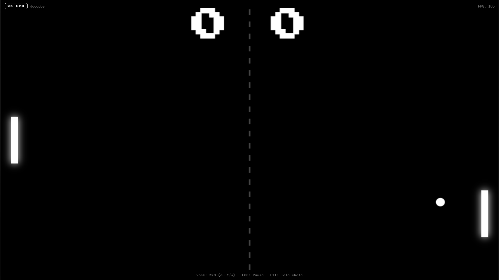
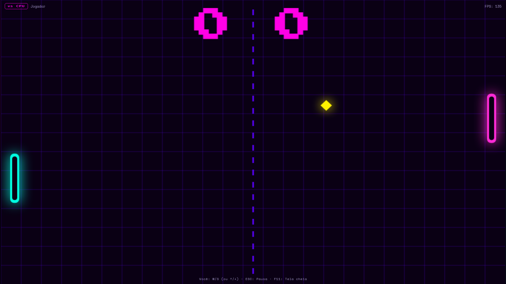
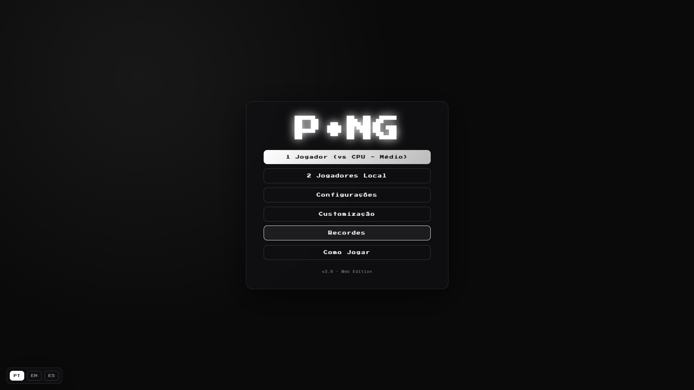
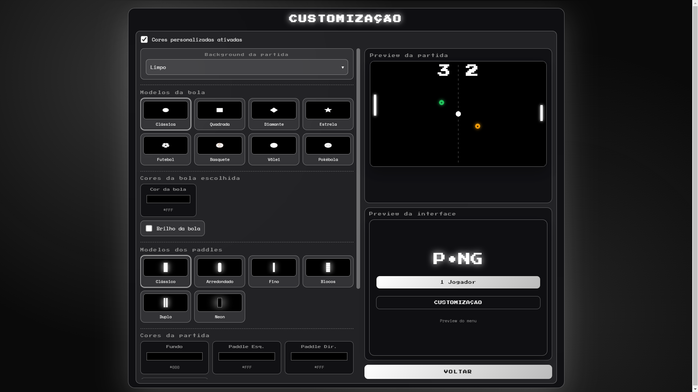

# Pong v3.0


**Pong v3.0** é uma versão moderna e personalizável do clássico jogo Pong, desenvolvida em HTML, CSS e JavaScript, com versão web para navegador e versão desktop criada com Electron.

O projeto combina a jogabilidade simples do Pong original com recursos modernos, como temas visuais, customização de cores, diferentes modelos de bola e paddles, power-ups, trilha sonora, múltiplos idiomas, contador de FPS e sistema de recordes locais.

## Preview

### Gameplay




### Menu




### Personalização




## Demonstração

O repositório possui duas versões do jogo:

- **Pong Web**: versão para navegador.
- **Pong Desktop**: versão desktop baseada em Electron.

## Funcionalidades

- Modo **1 jogador contra CPU**.
- Modo **2 jogadores local**.
- Dificuldades da CPU: fácil, médio, difícil e mestre.
- Sistema de pontuação configurável.
- Power-ups durante a partida.
- Pausa com `ESC`.
- Tela cheia com `F11`.
- Contador de FPS durante a partida.
- Trilha sonora com músicas pré-definidas.
- Upload de música própria.
- Sistema de recordes locais.
- Interface responsiva.
- Suporte a múltiplos idiomas:
  - Português
  - Inglês
  - Espanhol

## Customização

A tela de customização permite alterar vários elementos visuais do jogo:

- Temas pré-definidos.
- Background da partida.
- Cores da partida.
- Cores da interface.
- Modelos de bola.
- Cores específicas da bola.
- Brilho da bola.
- Modelos dos paddles.
- Preview da partida.
- Preview da interface.

## Controles

### 1 jogador

| Ação | Teclas |
|---|---|
| Mover paddle para cima | `W` ou `↑` |
| Mover paddle para baixo | `S` ou `↓` |
| Pausar | `ESC` |
| Tela cheia | `F11` |

### 2 jogadores local

| Jogador | Ação | Teclas |
|---|---|---|
| Jogador 1 | Mover para cima | `W` |
| Jogador 1 | Mover para baixo | `S` |
| Jogador 2 | Mover para cima | `↑` |
| Jogador 2 | Mover para baixo | `↓` |
| Ambos | Pausar | `ESC` |
| Geral | Tela cheia | `F11` |

## Estrutura do projeto

```text
Pong V3/
├── Pong Web/
│   ├── index.html
|   ├── ball.png
|   ├── README.md
│   ├── css/
│   │   └── styles.css
│   └── js/
│       ├── audio.js
│       ├── game.js
│       ├── i18n.js
│       ├── storage.js
│       ├── themes.js
│       └── ui.js
│
├── Pong Desktop/
│   ├── app/
│   │   ├── index.html
|   |   ├── README.md
│   │   ├── css/
|   |   |   └── styles.css
│   │   └── js/
│   |       ├── audio.js
│   |       ├── game.js
│   |       ├── i18n.js
│   |       ├── storage.js
│   |       ├── themes.js
│   |       └── ui.js
│   ├── main.js
│   ├── preload.js
│   ├── package.json
│   ├── ball.ico
│   ├── README.md
│   └── package-lock.json
│
├── .gitignore
└── README.md
```

## Como executar a versão web

Abra o arquivo abaixo diretamente no navegador:

```text
Pong Web/index.html
```

Também é possível usar a extensão **Live Server** no VS Code ou qualquer servidor local simples.

## Como executar a versão desktop

Entre na pasta da versão desktop:

```bash
cd "Pong Desktop"
```

Instale as dependências:

```bash
npm install
```

Execute o jogo:

```bash
npm start
```

## Como gerar o executável para Windows

Dentro da pasta `Pong Desktop`, execute:

```bash
npm run build:win
```

O executável será gerado na pasta:

```text
Pong Desktop/dist/
```

## Configurações e recordes

As configurações e os recordes são salvos localmente no navegador ou no ambiente Electron usando `localStorage`.

O projeto foi deixado com os valores padrão definidos no código, sem recordes salvos no repositório.

Configuração inicial padrão:

- Tema: clássico.
- Idioma: português.
- Modo de cores personalizadas: desativado.
- Dificuldade: médio.
- Pontos para vencer: 7.
- Power-ups: ativados.
- Nome do jogador: Jogador.

## Tecnologias utilizadas

- HTML5
- CSS3
- JavaScript
- Canvas API
- Web Audio API
- LocalStorage
- Electron
- Electron Builder

## Observações

- A pasta `node_modules` não deve ser enviada para o GitHub.
- Para instalar as dependências da versão desktop, use `npm install`.
- O comando de build disponível é `npm run build:win`.
- O projeto não depende de backend ou banco de dados.

## Versão

**Pong v3.0**

## Autor

Desenvolvido por Mathias Méndez.
